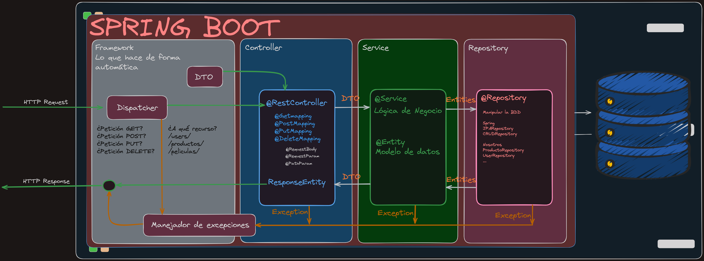
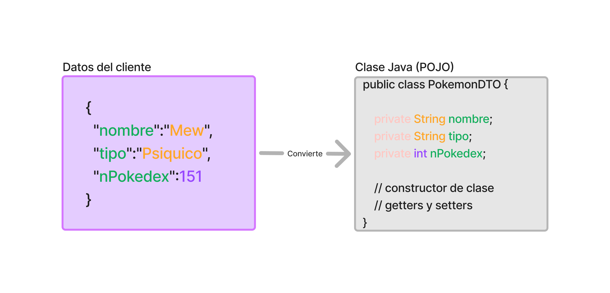
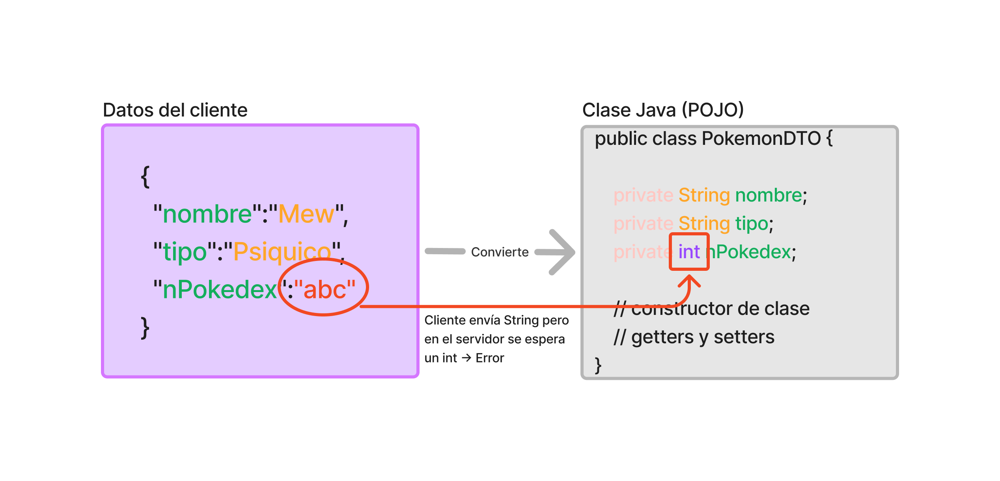

# Lección: Flujo de Datos en una API REST

### Introducción

En una API REST, el flujo de trabajo se organiza en un modelo **petición-respuesta** utilizando el protocolo HTTP. Este flujo atraviesa diferentes capas y sigue patrones de diseño específicos, como el **controlador frontal** y el manejo de excepciones centralizado, para asegurar que las solicitudes se procesen correctamente y se gestionen los errores de manera eficiente. Vamos a analizar cada una de estas etapas en detalle.

---

### 1. Modelo de Petición-Respuesta en HTTP

El protocolo **HTTP** sobre el cual operan las APIs REST es un sistema de **petición-respuesta**. Esto significa que el cliente realiza una petición (request) y el servidor responde (response) con un resultado. El resultado puede ser una respuesta exitosa, que contiene los datos solicitados, o un error, si algo ha fallado en el proceso.

1. **Petición (Request)**: La solicitud enviada por el cliente puede ser una creación, actualización, consulta o eliminación de un recurso.
2. **Respuesta (Response)**: La respuesta del servidor indica si la solicitud fue procesada con éxito o si hubo un error, utilizando códigos de estado HTTP como **200 OK**, **400 Bad Request**, **404 Not Found**, o **500 Internal Server Error**.

La naturaleza sin estado (stateless) de HTTP implica que cada petición es independiente, sin conservar información de solicitudes anteriores. Esto es esencial para la escalabilidad y simplicidad de las APIs REST.

---

### 2. Controlador Frontal y Framework

Para gestionar todas las peticiones de manera uniforme, se utiliza un patrón llamado **Controlador Frontal** (Front Controller). Este patrón centraliza el procesamiento inicial de todas las solicitudes. En la mayoría de los frameworks web, el controlador frontal actúa como un **dispatcher** (dispatcher) que recibe todas las peticiones y decide cómo se procesarán.

- **Controlador Frontal (Front Controller)**: Este elemento centraliza la entrada de las peticiones y facilita la implementación de lógica común para cada solicitud. Permite que los desarrolladores no tengan que gestionar cada petición individualmente y asegura que todas las peticiones se procesen de manera consistente.
- **Despachador (Dispatcher)**: El dispatcher analiza la solicitud entrante y determina a qué recurso o componente de la aplicación debe delegarse la petición. También realiza una verificación preliminar de los datos y, si detecta un error en la solicitud, puede lanzar una excepción que activa el manejador de excepciones.

Este controlador frontal suele ser gestionado por el framework que estés utilizando, lo que facilita la estructura del flujo de trabajo en aplicaciones complejas.

---

### 3. Flujo Inicial del Dispatcher  y Conversión de Datos

Una vez que el dispatcher ha aceptado la solicitud, convierte los datos que vienen en formato de cadena (string) a [DTOs](https://www.baeldung.com/java-dto-pattern) (Data Transfer Objects). Estos objetos son representaciones simplificadas de datos que pueden ser utilizados fácilmente dentro de la aplicación.

1. **Conversión a DTOs**: Como las solicitudes HTTP llegan en formato de texto, el framework convierte esos datos en objetos Java o en el lenguaje que se esté utilizando, mediante un proceso de deserialización. Esto permite que la aplicación trabaje con objetos estructurados y no con texto sin formato.

2. **Validación Inicial**: El dispatcher verifica si los datos de la solicitud tienen el formato adecuado. Si encuentra un problema (por ejemplo, campos faltantes o mal formados), lanza una excepción que activa el manejador de excepciones y envía una respuesta de error al cliente.

---

### 4. Manejador de Excepciones

Un aspecto clave de este flujo de trabajo es el **manejador de excepciones** centralizado. Este componente es responsable de interceptar y gestionar todos los errores que ocurren durante el procesamiento de una solicitud.

- **Centralización de Errores**: Al tener un único punto para gestionar excepciones, el código se vuelve más claro y fácil de mantener. Cualquier excepción que ocurra en las etapas posteriores (validación, procesamiento o acceso a la base de datos) se envía al manejador de excepciones.
- **Flujo de Respuesta en Caso de Error**: Si el manejador detecta un error, devuelve una respuesta al cliente con el código HTTP correspondiente y un mensaje que explica el fallo. Esto mejora la experiencia del usuario al recibir respuestas claras y facilita la depuración y monitoreo de la API.

El manejo de excepciones también ayuda a proteger el sistema de ataques o errores inesperados, permitiendo que la API devuelva errores controlados en lugar de fallos internos que puedan comprometer la seguridad.

---
